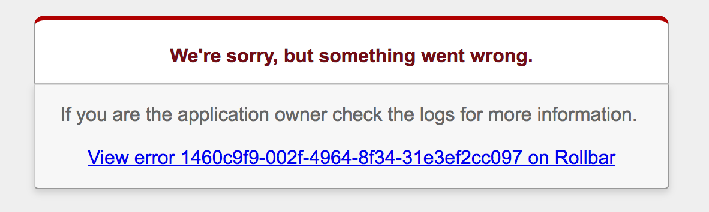

Shows exception uuids and links to them on error pages for easier support



Install
=======

```Bash
gem install rollbar-user_informer
```

Details
=====
* Adds rack middleware `Rollbar::UserInformer::Middleware` that inserts a link to Rollbar in error pages.
* Allows customization of error message with `Rollbar::UserInformer.user_information` (replaces `{{error_uuid}}` 
with the error uuid from Rollbar.)
* Allows customizing error page placeholder `Rollbar::UserInformer.user_information_placeholder`, must match 
what is on the error page (default is `<!-- ROLLBAR ERROR -->`).

Usage
=====
```ruby
# Gemfile
gem 'rollbar-user_informer'

# config/initializers/rollbar.rb
Rollbar.configure do |config|
...
end

Rollbar::UserInformer.user_information = <<~HTML
  <br/><br/>
  <a href="#{Rollbar.notifier.configuration.web_base}/instance/uuid?uuid={{error_uuid}}">
    View error {{error_uuid}} on Rollbar
  </a>
HTML
```
```html
# public/500.html
<body>
  <div class="dialog">
    <h1>We're sorry, but something went wrong.</h1>
  </div>
  <p>
    If you are the application owner check the logs for more information.
    <!-- ROLLBAR ERROR -->
  </p>
</body> 
```

Author
======
[Ryan Gurney](https://github.com/ragurney)<br/>
ryan.a.gurney@gmail.com<br/>
License: MIT<br/>
[](https://travis-ci.org/ragurney/rollbar-user_informer)
